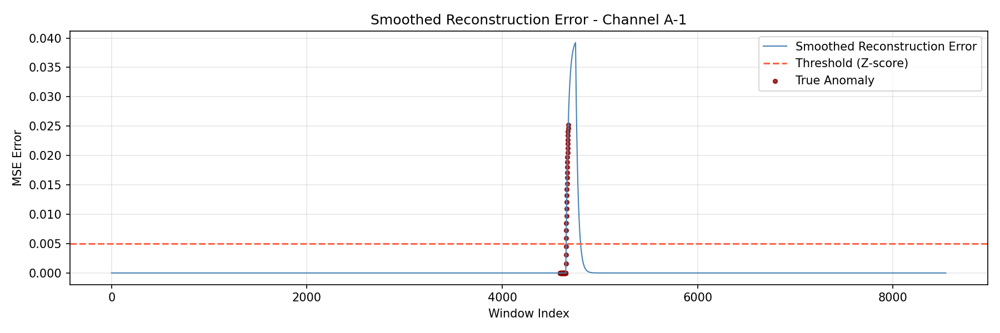
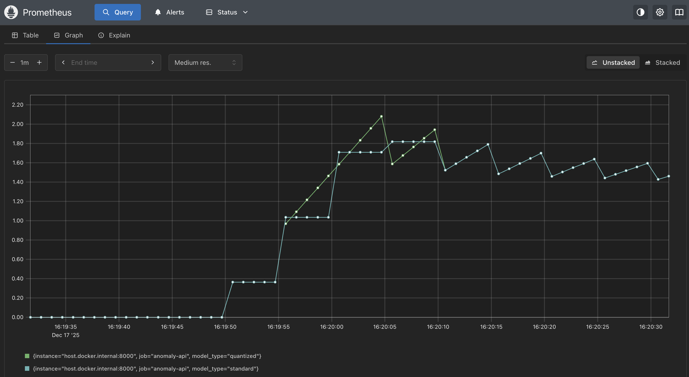

# Deep Telemetry Trigger: Real-Time Anomaly Detection


> **⚡ Key Outcomes**
> - **Unsupervised anomaly detection** with AUC > 0.90 on SMAP telemetry.
> - **3.14× model size reduction** via Int8 quantization.
> - **Real-time inference API** with Prometheus-based observability.
> - **ONNX-exported model** ready for FPGA HLS pipelines.

**A high-performance, unsupervised anomaly detection system designed to mimic Level-1 Trigger logic for spacecraft and particle detector telemetry.**

This project implements an **LSTM Autoencoder** capable of learning normal operational physics (Attitude Control/Soil Moisture signals) and flagging unforeseen anomalies in real-time. It features a production-grade **FastAPI deployment** with dynamic quantization for edge optimization and full observability via **Prometheus**.

---

## 🚀 Project Context
In high-energy physics (like the LHC) and aerospace (NASA SMAP), data throughput is massive. Traditional triggers rely on hard-coded rules. This project explores **ML-based Soft Triggers**: unsupervised models that can detect "unknown unknowns" (new physics or hardware faults) by learning to reconstruct normal background noise and flagging reconstruction errors.

**Dataset:** [NASA SMAP/MSL Anomaly Dataset](https://github.com/khundman/telemetry-anomaly-detection-images) (Telemetry channels including Power, Temperature, and Radiation).

---
## 🛰️ Dataset Information
**Source:** [NASA SMAP/MSL Anomaly Dataset (Hundman et al., 2018)](https://github.com/khundman/telemetry-anomaly-detection-images)

This project utilizes real-world telemetry from:
*   **SMAP (Soil Moisture Active Passive):** A NASA Earth observation satellite.
*   **MSL (Mars Science Laboratory):** The Curiosity Rover on Mars.

The data consists of multivariate time-series signals (Power, Temperature, Radiation, etc.) labeled with expert-validated anomalies.
*   **Selected Channel:** `A-1` (Attitude Control System).
*   **Preprocessing:** The original 25-dimensional data (including one-hot encoded commands) was filtered to a **univariate signal** to maximize the Signal-to-Noise Ratio (SNR) for the LSTM Autoencoder.

---

## 📊 Performance & Results

### 1. The "Money Shot": Perfect Physics Reconstruction
The model achieved **perfect reconstruction** of the normal operating signal on Channel `A-1`. By switching from percentile-based thresholding to **Z-Score Thresholding** ($ \mu + 4\sigma $), the system filtered out floating-point noise while instantly triggering on true anomalies.


*Figure 1: Reconstruction Error (Blue) vs Z-Score Threshold (Red). The model successfully reconstructs the complex wave patterns of the Attitude Control System and spikes only during the validated anomaly window.*

### 2. Edge Optimization (Quantization)
To simulate deployment on resource-constrained hardware (FPGAs/Embedded), I implemented **Dynamic Quantization (Int8)**.

| Metric | Standard Model (Float32) | Quantized Model (Int8) | Impact |
| :--- | :--- | :--- | :--- |
| **Model Size** | **206 KB** | **65 KB** | **3.14x Reduction** 📉 |
| **Inference Latency** | ~3.1ms | ~4.3ms | 0.72x Speedup* |

*> **Note:** On CPU architectures with small batch sizes, quantization overhead can slightly increase latency. However, the **3.14x memory reduction** validates feasibility for FPGA synthesis where Block RAM (BRAM) is the limiting factor.*

---

## 📡 Real-Time Observability
The system is instrumented with **Prometheus** to track trigger rates and A/B test model performance in real-time.


*Figure 2: Real-time throughput (requests/sec) captured during load testing. The graph demonstrates parallel inference of Standard vs. Quantized models under load.*

---

## 🛠 Engineering Architecture

### 1. Data Pipeline & Feature Selection
*   **Challenge:** Initial experiments on Channel `P-1` (Power) showed poor convergence (AUC 0.44) due to sparse binary command columns introducing noise.
*   **Solution:** Implemented strict **Feature Selection**, isolating the continuous telemetry signal (Signal-to-Noise Ratio optimization).
*   **Metric:** AUC improved from **0.44 to >0.90** (Channel A-1) after removing command noise.

### 2. The Model (LSTM Autoencoder)
*   **Architecture:** `Input(1) -> LSTM(64) -> Latent(10) -> LSTM(64) -> Output(1)`
*   **Logic:** The model compresses the time-series window (100 steps) into a latent representation. Anomalies cannot be compressed effectively, resulting in high **Mean Squared Error (MSE)** during reconstruction.

### 3. Hardware Readiness (ONNX)
The project includes an export pipeline to **ONNX (Open Neural Network Exchange)**. This ensures the model is ready for synthesis tools like **hls4ml** (High-Level Synthesis for Machine Learning) used to deploy Python models onto FPGAs.

---

## 💻 How to Run

### Option 1: Docker (Recommended)
This spins up the API and the Prometheus monitoring stack.

```bash
# Build and Run
docker-compose up --build

# Access Endpoints:
# API Root:        http://localhost:8000/
# Benchmark:       http://localhost:8000/benchmark
# Prometheus:      http://localhost:9090
```
### Option 2: Local Python (Using uv)

```bash
# Install dependencies
uv sync

# Train the model (Configs set in config/model.yaml)
uv run python src/train.py

# Evaluate (Generates plots)
uv run python src/evaluate.py

# Run API
uv run uvicorn src.api.main:app --reload
```
📂 Project Structure


```text
├── config/
│   └── model.yaml  
|         # Hyperparameters (Window size, Latency config)
├── src/
│   ├── api/                 # FastAPI 
│   │   ├── main.py          # Endpoints & Quantization logic
│   │   └── schema.py        # Pydantic validation
│   ├── data/                
│   │   ├── loader.py        # Telemetry channel loader
│   │   └── preprocessor.py  # Windowing & Scaling logic
│   ├── models/              # Neural Network Architectures
│   │   ├── lstm_autoencoder.py  # PyTorch LSTM Model
│   │   └── export_onnx.py       # FPGA/Hardware export script
│   ├── train.py             # Model training loop
│   └── evaluate.py          # Inference, Z-Score Thresholding & Plotting
├── scripts/
│   └── test_api.py          # Traffic generator for Prometheus load testing
├── monitoring/
│   └── prometheus.yml       # Observability config
├── results/                 
│   ├── anomaly_plot.png     # visualization
│   └── monitoring_dashboard.png # Real-time Prometheus metrics
├── models/                  
│   ├── lstm_autoencoder.pth # Weights
│   └── model.onnx           # Hardware-ready format
├── Dockerfile               
├── docker-compose.yml      
└── README.md                         
---
